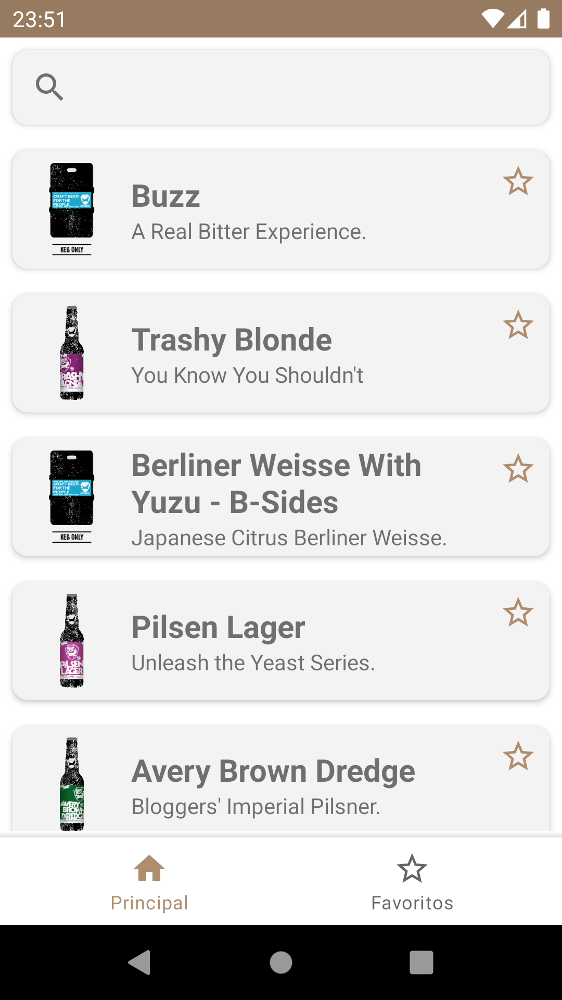
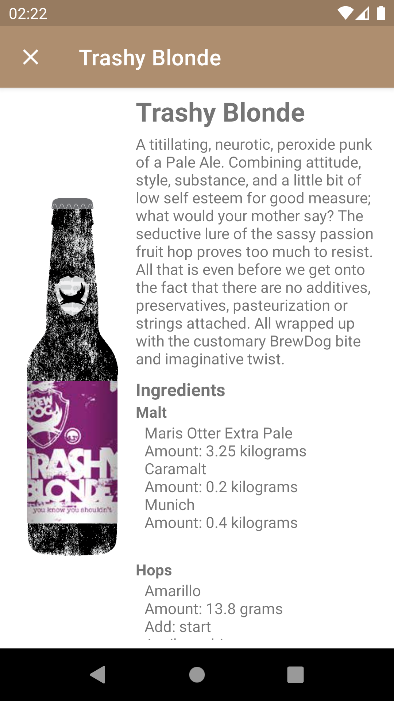

# Cervejeiros_SA
A beer showcase app developed using Java,Retrofit and the PUNK API

 

## Built with:
* Java - Programming Language
* Retrofit - Used to consume API 
* [PUNKAPI](https://punkapi.com/documentation/v2) - API that provided beer info

## TODO:
- [ ] Favorite List
- [ ] Infinite Scroll
- [ ] Search System

